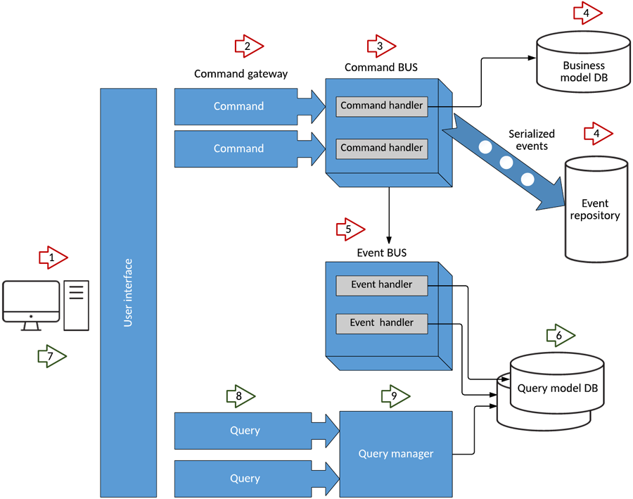

# CQRS模式概述

为什么要选择CQRS模式来实现微服务？在传统的应用结构中，应用通常要对在数据库中持久化的数据进行操作。通常为数据模型实体使用唯一的数据库，同时用于读取和写入。数据的设计由写入和更新操作驱动，以保持数据一致性。开发人员尝试使用正规化(normalization)技术来最小化数据冗余。虽然有必要以规范化的形式存储数据，但这可能对读取操作是不利的。为了提取一些数据，开发人员需要编写复杂的 SQL 查询，来从多个表中连接(join)数据。

此外，在许多应用中，数据创建一次并且仅偶尔进行修改，可能读取多次。因此，开发人员需要特别注意读取性能; 访问数据应该尽可能少的查询，并且每个查询期间执行的业务逻辑应该被最小化。 这就是 `CQRS` 模式的由来。

Thoughtworks 的 [Martin Fowler](http://martinfowler.com/bliki/CQRS.html) 这样描述 `CQRS`： "其核心概念在于更新信息时可以使用不同于读取信息时的模型"。

`CQRS` 模式为识别服务和分发各种业务方面提供了指导。 基本思想是将对领域对象的操作划分为两个不同的类型：

- 查询 - 返回结果并且不更改系统状态的方法。
- 命令 - 更改系统状态但不返回值的方法。

好消息是查询和命令可以解耦。它们之间的链接通过事件体现，命令处理生成的事件填充查询数据的存储库。

事件被持久化到事件存储库中。业务模型数据库因此可以包含系统的最后状态，但事件存储库保留数据的整个历史记录。 通过这种分离的问题，开发人员可以自由地为每个模式组件选择最合适的技术，并且可以（如果需要）构建多样化的应用程序。（例如，可以为命令数据库选择RDBMS，为事件存储库选择内存数据库，和为查询数据库选择NoSQL）

图1 显示主要模式元素：

