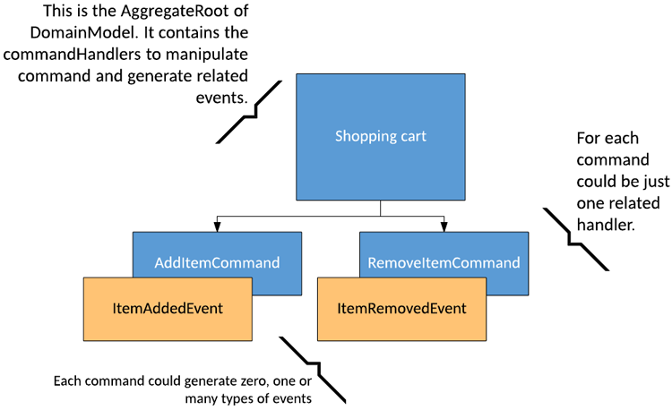

# 步骤 1. 选择应用上下文

首先，您需要定义 bounded context 及其领域实体。用这种方式，您将定义AggregateRoot（例如，订单，诊所访问或旅行）。根据 [Axon 框架网站](http://www.axonframework.org/docs/2.4/domain-modeling.html)，aggregate root 是始终处于一致状态的一个实体或一组实体，aggregate root是aggregate tree顶端的对象，负责维护一致状态。

在我的例子中，bounded context是（非常简化的）在线植物商店的购物车。与任何在线购物车一样，使用此购物车的购物者可以添加商品，删除商品，清空购物车，查看购物车中的商品，并在购物完成后进行结帐。

图 2. 购物车聚合对象



- Shopping cart: 领域模型的聚合根。包含命令处理器来操作命令并生成对应的事件
- Command： 每个命令只有一个对应的命令处理器
- Event：每个命令可能生成零，一或者多个类型的事件

注意： aggregate root 通常通过它的 AggregateIdentifier 来识别：

```java
public class ShoppingCart extends AbstractAnnotatedAggregateRoot {
    @AggregateIdentifier
    private String id;
    public ShoppingCart() {
    }
	//…..
}
```

在 Spring 配置中, 我将 aggregate root 对象 (ShoppingCart) 连接到它的 command bus 和 event repository:

```xml
<axon:aggregate-command-handler id="ShoppingCartHandler"
	aggregate-type="cqrs.example.shoppingcart.model.ShoppingCart"
	repository="shoppingCartRepository"
	command-bus="commandBus" />
```
