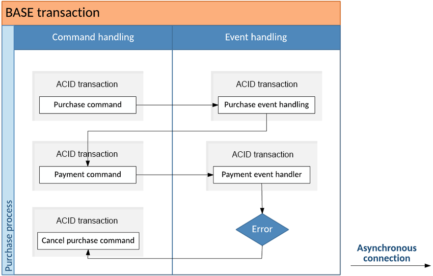

# 步骤 4：配置命令处理

Axon框架最显着的优势之一是易于配置。在本节中，我将介绍我在应用程序中所做的一些配置选择。

通过命令总线，每个命令被分派到其各自的处理器。命令总线定义插入到配置的 Spring 文件中。

```xml
<!-- 定义命令总线 -->
<axon:command-bus id="commandBus" transaction-manager="transactionManager" />
```

在 commandBus 定义中，您将看到 `transaction manager` 引用; 它用于在命令处理期间管理事务。

```xml
<bean id="transactionManager" class="org.springframework.orm.jpa.JpaTransactionManager">
	<property name="entityManagerFactory" ref="entityManagerFactory"/>
	<property name="dataSource" ref="dataSource"/>
</bean>
```

在采用 CQRS 模式用于应用程序开发时，请考虑 CQRS 的事务性方面。命令不能丢失。您需要一个事务管理器（以处理ACID事务），以确保每个命令都被处理，并且事件被生成并在事件存储中持久化。这适用于命令处理，但如果考虑关于流的异步特性的整个事务（从运行命令到事件监听器执行），则它是一个 `BASE` 事务。 `BASE` 是Basic Available/基本可用，Soft state/软状态，Eventually consistent/最终一致的首字母缩略词。

- 基本可用 - 系统必须确保数据的可用性。每个请求都会有一个答案。
- 软状态 - 系统的状态可能随时间而变化，即使在没有输入的期间。这样，系统状态总是“软”。数据的一致性需要由开发人员管理，而不是数据库。
- 最终一致 - 当新数据被添加到系统时，它逐渐传播，一次一个节点，使整个系统一致。一旦停止接收输入，系统最终将完全一致。

这个的结果之一是需要重新考虑事务回滚。在 `BASE` 模型中，事务回滚不是自动的; 您必须为此设计适当的补偿措施。 例如，如果用户确认他的购物车并购买物品，则应用程序执行相关的购买命令。如果它被提交（作为一个ACID事务），你不能再改动它。接下来发生的一切都是异步，取决于这个命令的执行。现在，假设购买活动的监听器有开始支付过程的意向。 如果付款不成功，则无法回滚购买命令。相反，购买必须取消并通知到用户。

图3说明了这个业务流程。

Figure 3. 事务回滚流程




