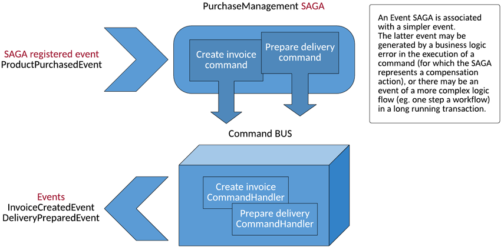

# 步骤 5：查找长期运行的事务

复杂事件,如上述讨论的,由 `SAGA` 规范定义的特殊组件管理。`SAGA` 通常被定义为“long-lived business transaction or process/长期业务交易或流程”。其背后的基础理论是避免在横跨大量资源时使用阻塞（和锁定）事务。

在我们的购买示例中，当 `ProductPurchased` 事件以某种方式生成时，与之关联的 `SAGA` 对象将发送 `CreateInvoice` 命令和 `PrepareDelivery` 命令。这是执行购买过程（或至少部分）的方式。

请注意，`SAGA` 对象包含业务行为，但仅以过程的形式。这是一个关键点：在最纯粹的形式中，`SAGA` 对象不包含业务逻辑。

图 4. SAGA 示例



在我的例子中，我写了以下 `SAGA` 对象来管理订单：

```java
public class PurchaseManagementSaga extends AbstractAnnotatedSaga {

    @StartSaga
    @SagaEventHandler(associationProperty = "itemId")
    public void handle(ProductPurchasedEvent event) {
        // identifiers
        String deliveryId = createDeliveryId();
        String invoiceId = createInvoiceId();
        // associate the Saga with these values before sending the commands
        associateWith("shipmentId", deliveryId);
        associateWith("invoiceId", invoiceId);
        // send the commands
        commandGateway.send(new PrepareDeliveryCommand(deliveryId));
        commandGateway.send(new CreateInvoiceCommand(invoiceId));
    }

    // ...
}
```
