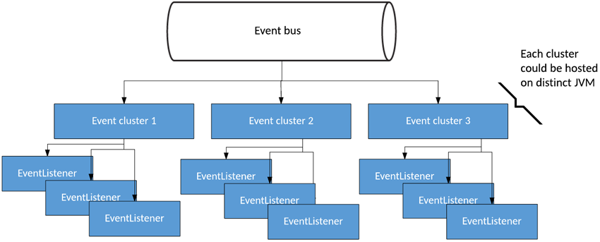

# 步骤 6：管理event sourcing

除了 `CQRS` 之外，Axon 框架还实现了一个 event sourcing 模式，用于将命令链接到查询。event sourcing 的使用带来很多好处，其中最重要的是建立一个系统，在设计上每个事情都可以被跟踪。（在传统的应用程序中，您需要登录才能知道谁做了什么。）所有生成的事件都会持久存入事件存储。

在我的例子中，我使用了关系数据库作为事件存储，定义如下：

```xml
<axon:jpa-event-store id="eventStore" entity-manager-provider="myEntityManagerProvider"
	event-serializer="eventSerializer" max-snapshots-archived="2" batch-size="1000"/>

<bean id="myEntityManagerProvider" class="org.axonframework.common.jpa.ContainerManagedEntityManagerProvider" />
```

这是事件存储的数据源定义：

```xml
<bean id="dataSource" class="org.springframework.jndi.JndiObjectFactoryBean">
	<property name="jndiName" value="jdbc/mydb"/>
</bean>
```

entityManagerFactory（提供数据库连接的bean）是这样定义的：

```xml
<bean id="entityManagerFactory" class="org.springframework.orm.jpa.LocalContainerEntityManagerFactoryBean">
    <property name="persistenceUnitName" value="eventstoredb"/>

    <property name="jpaVendorAdapter">
        <bean class="org.springframework.orm.jpa.vendor.HibernateJpaVendorAdapter">
            <property name="databasePlatform" value="${hibernate.sql.dialect}"/>
            <property name="generateDdl" value="${hibernate.sql.generateddl}"/>
            <property name="showSql" value="${hibernate.sql.show}"/>
        </bean>
    </property>
    <property name="dataSource" ref="dataSource"/>
</bean>
```

In the event store, you can find the tables DOMAINEVENTENTRY and SNAPSHOTEVENTENTRY (created by the framework the first time), each of which has the following columns:

在事件存储中，您可以找到表 `DOMAINEVENTENTRY` 和 `SNAPSHOTEVENTENTRY`（由框架在第一次时创建），其中每个表都具有以下列：

图 5. DOMAINEVENTENTRY 和 SNAPSHOTEVENTENTRY 表的详情


一些示例内容如 图6 所示:

图 6. DOMAINEVENTENTRY 表内容示例


The event bus is the mechanism that dispatches the events to their listeners. Each event can have one or more listeners associated with it. Using the default implementation, you would write:

event bus/事件总线是将事件分派给监听器的机制。每个事件可以有一个或多个与之相关联的监听器。使用默认实现，可以这样写：

```xml
<axon:event-bus id="eventBus"/>
```

框架提供两个可用实现：

- SimpleEventBus可以同时完成和本地进行调度： 在大多数情况下，适用 SimpleEventBus 。调度同步在本地完成（例如在单个JVM中）
- ClusteringEventBus: 当您的应用程序需要在多个JVM（即云生态系统）中发布事件时，ClusteringEventBus 是合适的。因此，调度是异步的和分布式的

图7 展示 clustering event bus。

图 7. Clustering event bus



以下是如何声明解决方案：

```xml
<!-- Create an async cluster -->
<axon:cluster id="async">
	<!-- 内部 bean 定义要使用的实际集群实现. 这里, 是一个异步集群 -->
    <bean class="org.axonframework.eventhandling.async.AsynchronousCluster">
        <constructor-arg value="async"/>
        <constructor-arg ref="asyncExecutor"/>
        <constructor-arg>
            <bean class="org.axonframework.eventhandling.async.FullConcurrencyPolicy"/>
        </constructor-arg>
    </bean>
    <!-- 这里, 我们定义需要成为这个集群一部分的处理器 -->
    <axon:selectors>
       <axon:package prefix="cqrs.example.shoppingcart.eventhandler"/>
    </axon:selectors>
</axon:cluster>

<!-- 我们同样创建一个 simple 集群并定义它为默认
	意味着如果没有其他 selectors (或集群)匹配，将选择这个 -->
<axon:cluster id="simple" default="true"/>

<!-- 需要一个 thread pool 来执行任务 -->
<bean id="asyncExecutor" class="org.springframework.scheduling.concurrent.ThreadPoolExecutorFactoryBean">
    <property name="corePoolSize" value="1"/>
    <property name="waitForTasksToCompleteOnShutdown" value="true"/>
</bean>
```

注意 `selectors` 的声明。这些允许您选择集群来关联监听器。（包`cqrs.example.shoppingcart.eventhandler` 中的所有监听器都使用名为 "async" 的集群进行处理。所有其他监听器都使用名为 "simple" 的集群进行处理，这是默认情况。）

ClusteringEventBus 也可以定义 EventBusTerminal。这样，您可以分发事件来将事件传输到与 `AMQP` 兼容的消息代理（如Rabbit MQ）。我已经在我的一个应用程序配置（只配置，没有代码更改）中使用了这个功能。有关部署此解决方案的信息，请参阅“Bluemix容器部署”。

