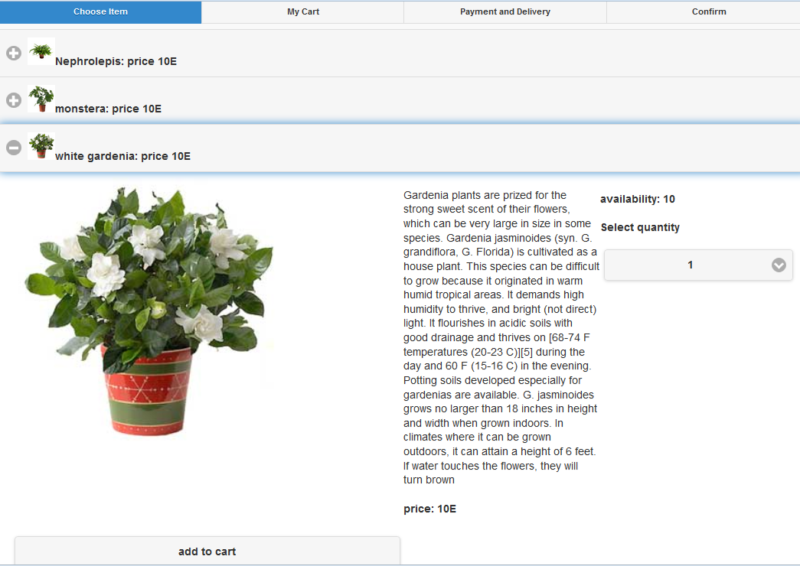

# 步骤 8：和应用交互

为了与服务交互，可以实现 REST 服务，将命令服务（HTTP Put Request）从查询服务（HTTP Get Request）中分离出来。我已经创建了一个前端Web应用程序来激活服务，如图8所示。

图 8. 购物车前端



用户界面通过 Servlet 进行交互，其中命令由 `CommandGateway` 分派：

```java
private ApplicationContext ac;
private CommandGateway commandGateway;

@Override
protected void doGet(HttpServletRequest request, HttpServletResponse response) throws ServletException, IOException {
    response.setContentType("text/html");
    String itemId=request.getParameter("id");
    Integer quantity=Integer.parseInt(request.getParameter("quantity"));
    AddItemCommand addItemCommand=new AddItemCommand(itemId);
    addItemCommand.setQuantity(quantity);

    logger.debug("quantity:" + quantity);
    logger.debug("id:" + itemId);
	CommandCallback commandCallback = new CommandCallback<Object>() {
        @Override
        public void onSuccess(Object result) {
            logger.debug("Expected this command to fail");
        }

        @Override
        public void onFailure(Throwable cause) {
            logger.debug("command exception", cause.getMessage());
        }
    };
    //asynchronous call – with command callback
     commandGateway.send(addItemCommand, commandCallback);
}

@Override
public void init(ServletConfig config) throws ServletException {
   super.init(config);
   ac = new ClassPathXmlApplicationContext("/axon-db2-configuration.xml");
   commandGateway= ac.getBean(CommandGateway.class);
}
```

在 servlet 初始化中，我加载了所有Axon组件的配置，包含在 Spring 配置文件中的。

另外，您可能会注意到这些命令是通过命令网关进行调度的。在示例中，我以异步方式发送 `AddItemCommand`，而不等待流程结束。我注册了一个 command callback 以便出现最终异常时能被通知。这允许系统通知用户，如果库存中的实际可用性是否小于所请求的数量。（如果另一个用户在第一个用户正在查阅目录时将该商品添加到自己的购物车中，可能会发生这种情况。）
