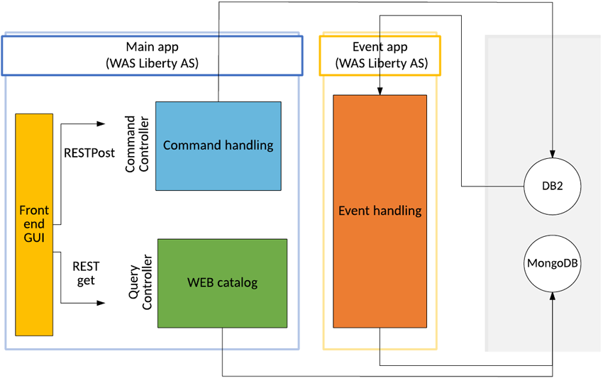
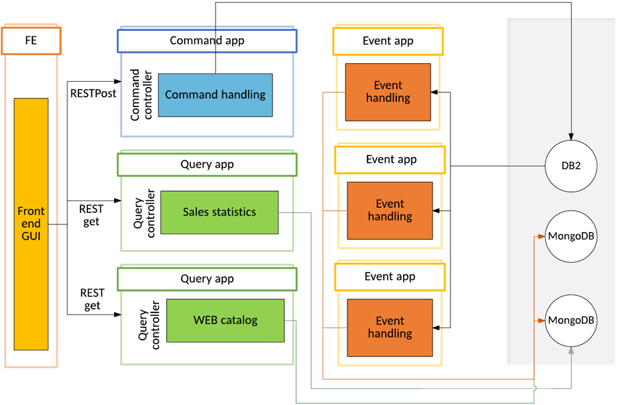
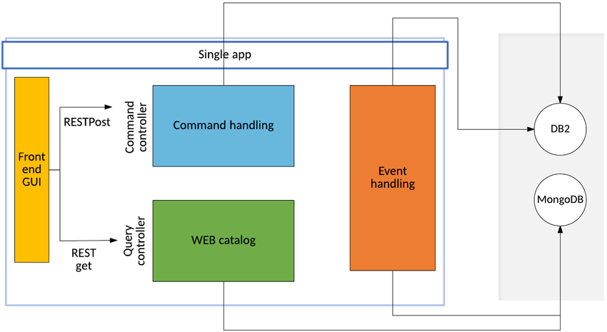
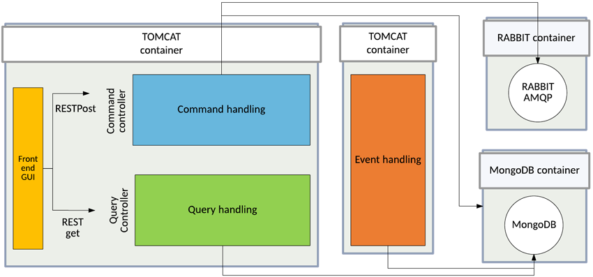
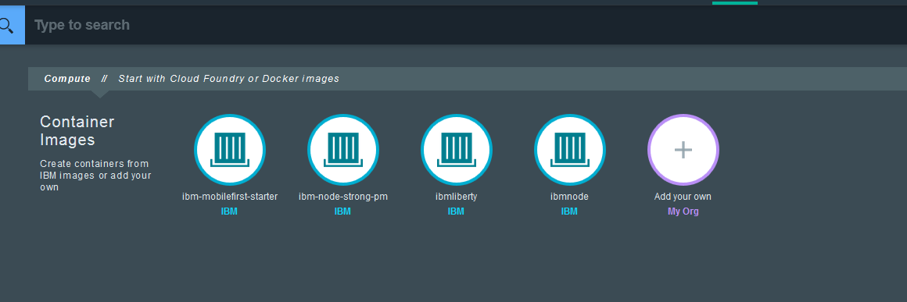

# 步骤 9：部署

使用微服务器构建的应用程序允许选择不同的部署解决方案。单体应用程序经常被迫部署在专用机器上。然而，在微服务的情况下，部署可以在同一台机器上完成，也可以在多台机器之间，取决于性能，安全性和可扩展性等需求。考虑到Axon框架使您能够更改配置而不更改任何代码（除Spring文件之外），以及应用程序组件的松耦合，您可以看到对于应用程序部署有多少自由度 。每个应用程序组件 - 命令总线，事件总线，事件存储库，命令处理，事件处理等 - 都可以托管在使用不同技术的机器的不同组合上。在本节中，我向您展示了其中的几个。

## Bluemix PaaS 部署

在 `Bluemix` 上部署我的应用程序时，安装包包括：

- 命令处理组件 - 更新请求（HTTP POSTs）。
- 查询处理组件 - 显示请求，与命令服务（HTTP GET）分离。
- 事件处理组件 - 包含事件监听器

该应用程序绑定两个 `Bluemix` 服务（DB2和MongoDB），用于持久化命令数据和event sourcing。

图9 显示了作为单个应用程序的可能部署。该解决方案可用于简化部署和测试。

Figure 9. 作为单个宏模块部署



在图10中，我将应用程序拆分为七个宏模块，这使我能够为每个宏模块提供正确的资源级别。（对于每个人，我可以选择虚拟机的数量，应用程序语言，数据库服务等）。每个宏都可以在应用服务器上部署为 `WAR` 文件。



目前在 `Bluemix` 上，我已经部署了一个中间解决方案，使用 WebSphere Application Server Liberty 作为应用服务器，我已经安装了两个Web应用程序：一个用于前端，命令处理和查询处理，另一个用于事件处理。



对于这个解决方案，我只需要以不同的方式打包应用程序（我有两个WAR文件），但是所有的代码都没有改变。

## Bluemix 容器部署

另一种可能性是使用 `Bluemix` 容器进行部署。

通过仅更改 `Spring` 配置文件（而不是应用程序代码），您可以更改部署方案。我相信这种适应可用环境的能力是这种模式最令人兴奋的特征。在这种情况下，我使用 MongoDB 作为事件存储和 Rabbit-MQ 作为事件总线。 图12 显示了如何组织容器来托管应用程序组件。

图 12. 使用 Bluemix 容器部署



如果这是您第一次使用容器，请登录到 Bluemix 控制台，然后选择 **Add your own**。

图 13. Bluemix 容器控制台



首次执行此操作时，必须为与您的私有 Bluemix 存储库相关联的命名空间设置名称。命名空间用于生成唯一的URL。 然后，您将收到访问 Bluemix 容器空间的所有说明。

有关在 Bluemix 上管理 Docker 容器的完整指南，请参阅："[IBM Containers插件（cf ic）](https://console.ng.bluemix.net/docs/containers/container_cli_cfic.html)"。

您需要Cloud Foundry CLI。要安装 Bluemix Docker 插件（我安装在我的 Ubuntu 上），请输入以下内容：

```bash
./cf install-plugin https://static-ice.ng.bluemix.net/ibm-containers-linux_x64
```

登录到您的 Bluemix 空间，然后登录到 Bluemix 容器空间，然后输入：

```bash
./cf ic login
```

现在，您可以对您的私人注册表进行操作，添加应用程序所需的映像。除了应用程序的源代码，我提供的代码还包含用于创建和配置 Docker 映像的 Docker 文件。

